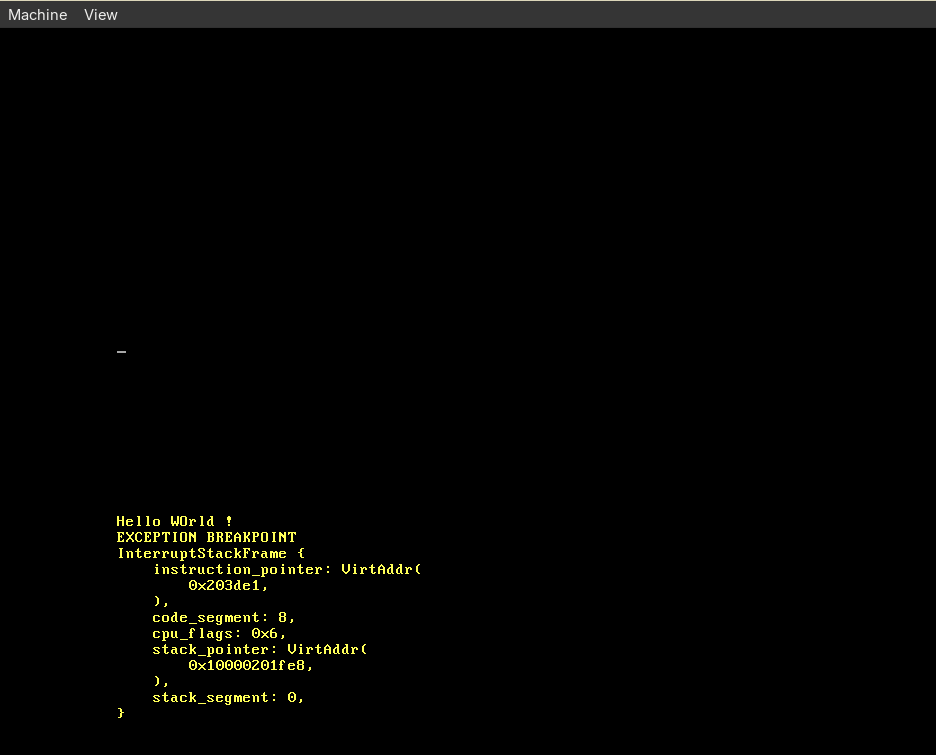
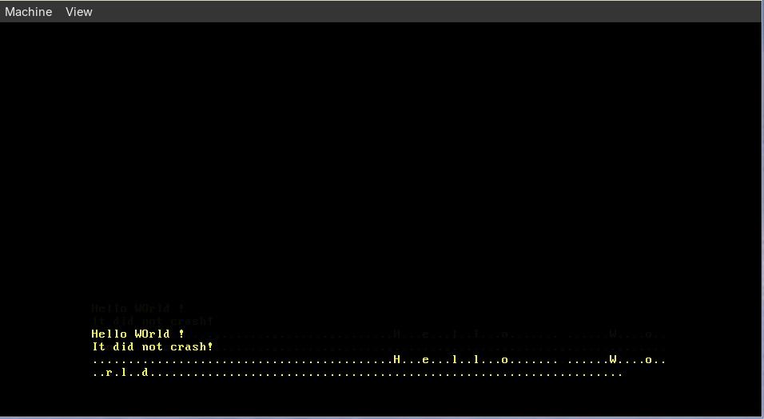

# MiniOS: Operating System Implementation In Rust
- A minimal OS implementation based on [os.phil-opp.com](https://os.phil-opp.com/minimal-rust-kernel/)
- Goal: Learn how OS-internals work by building one

## Output:

### Keyboard Input

## Progress
- [x] Free Standing Binary
- [x] Custom Target Triple for compilation
- [x] Learn about Qemu or other emulators
- [x] Interrupt Handlers
- [x] GDT and TSS
- [x] Interrupt Stack Tables
- [x] Keyboard and peripheral support
- [ ] Memory Allocators
- [ ] Async Runtimes
