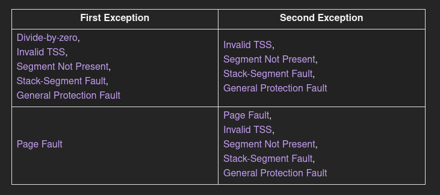

# Exceptions on x86
An exception signals that something is wrong with the current instruction. For example, the CPU issues an exception if the current instruction tries to divide by 0. When an exception occurs, the CPU interrupts its current work and immediately calls a specific exception handler function, depending on the exception type.

On x86, there are about 20 different CPU exception types. The most important are:

   - Page Fault: A page fault occurs on illegal memory accesses. For example, if the current instruction tries to read from an unmapped page or tries to write to a read-only page.
   - Invalid Opcode: This exception occurs when the current instruction is invalid, for example, when we try to use new SSE instructions on an old CPU that does not support them.
   - General Protection Fault: This is the exception with the broadest range of causes. It occurs on various kinds of access violations, such as trying to execute a privileged instruction in user-level code or writing reserved fields in configuration registers.
   - Double Fault: When an exception occurs, the CPU tries to call the corresponding handler function. If another exception occurs while calling the exception handler, the CPU raises a double fault exception. This exception also occurs when there is no handler function registered for an exception.
   - Triple Fault: If an exception occurs while the CPU tries to call the double fault handler function, it issues a fatal triple fault. We can’t catch or handle a triple fault. Most processors react by resetting themselves and rebooting the operating system.

   ## Double Faults Occur Only when:

